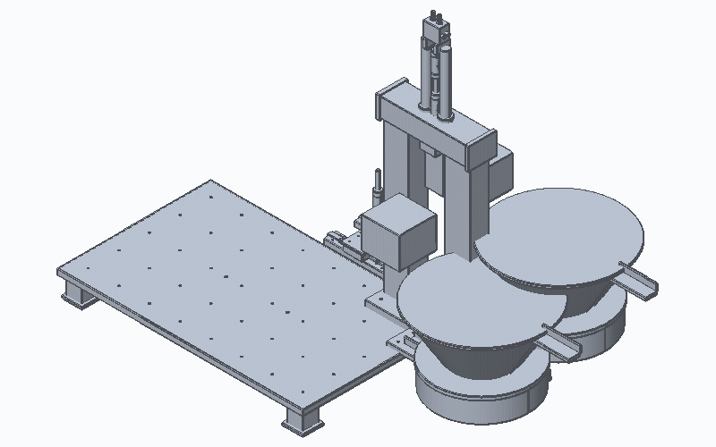

<div align="center">



<br>

# ⚙ Open Source Text to CAD Assembly Harness ⚙

**Turn a text or image prompt into a source-controlled CAD assembly — then export, inspect, and iterate with your favorite coding agent.**

[](https://github.com/MountainClimberJiwen/text-to-cad-assembly/stargazers)
[](https://github.com/MountainClimberJiwen/text-to-cad-assembly/network/members)
[](LICENSE)
[](https://x.com/soft_servo)
[](requirements-cad.txt)
[](https://github.com/gumyr/build123d)
[](requirements-cad.txt)
[](skills/cad/SKILL.md)
[](skills/cad/SKILL.md)
[](skills/urdf/SKILL.md)
[](viewer/package.json)
[](viewer/package.json)
[](viewer/package.json)

</div>

---

## What is this?

This repository is a harness for **text-to-CAD-assembly** generation. Instead of modeling every part by hand in a GUI, you describe what you want in plain language — or even hand the agent a rough sketch or photo — and it writes the CAD source for you.

The result is not just a static mesh. It is:

- A **Python generator** under `models/` that produces the geometry parametrically.
- Exported **STEP/STL/GLB** files that you can open in any CAD or slicer.
- Optional **URDF** robot descriptions with joints and limits.
- A local **CAD Explorer** viewer to inspect, screenshot, and share geometry.
- Stable **`@cad[...]` references** so the agent can keep editing specific faces, edges, or parts in follow-up turns.

Everything runs locally. There is no cloud backend, no subscription, and no proprietary format lock-in.

## What can you build?

The `models/` directory already contains examples generated through this workflow:

| Example | Path | Description |
|---|---|---|
| Vision-based automation station | `models/assemblies/auto_station_from_vision.step` | A full assembly with a base plate, dual rotary bowls, and a vertical gantry — generated from an image prompt. |
| Pick-and-place arm | `models/assemblies/pick_place_arm_v3.step` | A multi-joint robotic arm assembly with URDF support. |
| Automation control unit | `models/assemblies/automation_control_unit.step` | A compact control-box assembly. |
| Simple bracket | `models/bracket.step` | A basic L-bracket for quick part-level demos. |

If you can describe it, the harness can turn it into source-controlled geometry.

## A typical Text-to-CAD loop

1. **Describe** the assembly in a prompt:
   > *“Build a vibratory feeder station with two bowl feeders on a shared aluminum base and a vertical press gantry.”*
2. **Edit**: the agent creates or updates Python generators under `models/`.
3. **Regenerate** explicit artifacts:
   ```bash
   ./.venv/bin/python skills/cad/scripts/gen_step_assembly models/assemblies/my_assembly.py
   ```
4. **Inspect** the result in the CAD Explorer at `http://localhost:4178`.
5. **Reference** a face or edge with `@cad[models/assemblies/my_assembly#f12]` and ask the agent to adjust it.
6. **Commit** the source and generated files together.

## ✨ Features

- **Generate assemblies from prompts** - Describe a part, fixture, mechanism, or robot in plain language (or from an image) and let a coding agent produce the CAD source.
- **Export** - Produce STEP, STL, DXF, GLB, topology data, and URDF robot descriptions.
- **Browse** - Inspect generated geometry in a local CAD Explorer viewer.
- **Reference** - Copy stable `@cad[...]` references so agents can make precise, geometry-aware follow-up edits.
- **Review** - Render quick snapshots for fast checks during an iteration loop.
- **Reproduce** - Edit source files first, then regenerate explicit targets.
- **Local** - Run the harness and viewer locally with no backend to host.

## 🧰 Bundled Skills

This harness vendors file-targeted skills for CAD and robot-description work. Use the bundled copies here for local `models/` projects, or use the dedicated repositories when installing the skills outside this harness.

- **CAD Skill** - STEP, STL, DXF, GLB/topology, snapshots, and `@cad[...]` geometry references. [Bundled docs](skills/cad/README.md) · [Standalone repo](https://github.com/earthtojake/cad-skill)
- **URDF Skill** - Generated URDF XML, robot links, joints, limits, validation, and mesh references. [Bundled docs](skills/urdf/README.md) · [Standalone repo](https://github.com/earthtojake/urdf-skill)

## 📁 Repository layout

```
.
├── models/                 # Generated CAD assemblies, parts, and robots
│   ├── assemblies/         # Assembly generators and exported STEP files
│   └── *.step / *.stl      # Exported geometry
├── viewer/                 # Local CAD Explorer (React + Three.js + Vite)
├── skills/cad/             # CAD generation, snapshots, and @cad[...] tooling
├── skills/urdf/            # URDF generation and validation tooling
├── freecad-assembler/      # Alternative FreeCAD-based assembly pipeline
├── cad_asm/                # Higher-level agent orchestration experiments
└── scripts/                # Utility scripts, including render_turntable.py
```

## 🚀 Quick Start

Clone the repo:

```bash
git clone https://github.com/MountainClimberJiwen/text-to-cad-assembly.git
cd text-to-cad-assembly
```

Install Python CAD dependencies:

```bash
python3.11 -m venv .venv
./.venv/bin/python -m pip install --upgrade pip
./.venv/bin/pip install -r requirements-cad.txt
```

Install viewer dependencies:

```bash
cd viewer
npm install
```

Run the local CAD Explorer:

```bash
npm run dev
```

Then open [http://localhost:4178](http://localhost:4178).

## 🤝 Contributing

This project is intentionally minimal: edit the source generator first, then regenerate explicit targets. If you add new models or improve a skill, include both the source and the generated artifacts so the repository stays reproducible.

## 📄 License

MIT — see [LICENSE](LICENSE).
